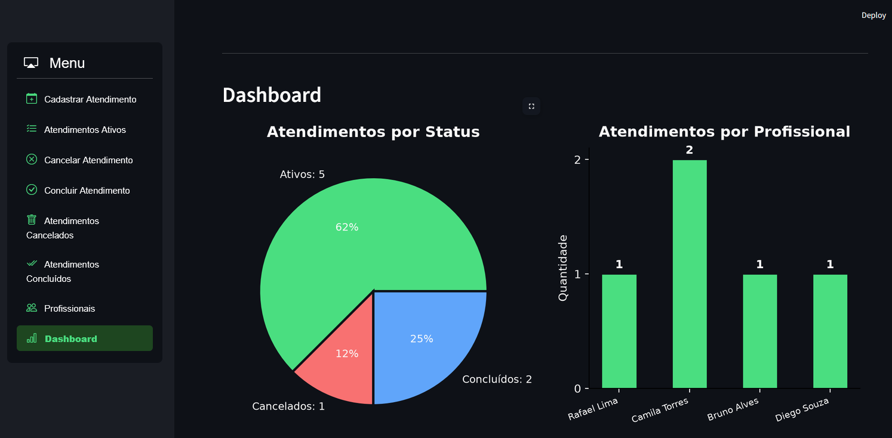
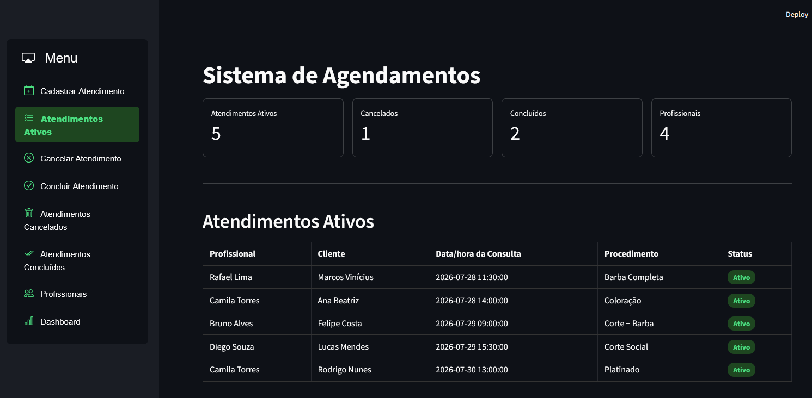
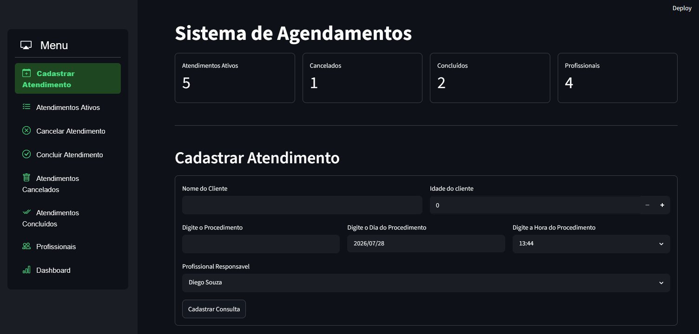

# Sistema de Agendamentos

Sistema web para gerenciamento de atendimentos com hora marcada, feito para negócios que trabalham com profissionais e clientes por agenda — clínicas, salões de beleza, barbearias, consultórios, personal trainers, entre outros.

Permite cadastrar atendimentos, gerenciar profissionais e acompanhar tudo em tempo real por um dashboard com gráficos.



## Funcionalidades

- **Cadastro de atendimentos** com validação de campos obrigatórios
- **Bloqueio automático de conflito de horário** — impede marcar dois atendimentos muito próximos para o mesmo profissional
- **Gestão de status**: atendimentos ativos, cancelados e concluídos, com regras de negócio (só é possível concluir um atendimento após o horário da consulta já ter passado)
- **Histórico separado** por status, com identificação visual (badges coloridos)
- **CRUD completo de profissionais**: cadastro, edição, listagem e desativação (sem perda de histórico)
- **Dashboard interativo** com gráficos de status, atendimentos por profissional e atendimentos por período



## Tecnologias

- **Python**
- **Streamlit** — interface web
- **SQLite** — banco de dados relacional
- **Matplotlib** — geração de gráficos
- **Pandas** — manipulação e exibição de dados
- **streamlit-option-menu** — navegação lateral



## Como rodar localmente

```bash
git clone https://github.com/robertob-data/booking-management-system.git
cd booking-management-system
pip install -r requirements.txt
streamlit run app.py
```

## Autor

**Roberto Batista Dias**
[GitHub](https://github.com/robertob-data)
